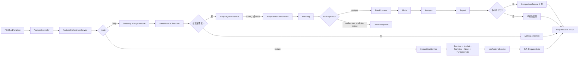

# Luria 架构图

## 1. 系统定位

这是一个基于 NestJS 的加密资产分析后端，核心目标是把用户的自然语言问题，编排成一条可执行的分析流水线，并输出即时回答或研究报告。

核心分层：

1. API 接入层
2. 编排层
3. Workflow 工作流层
4. 数据采集与风控层
5. 基础设施层

## 2. 总体架构图

```mermaid
flowchart TB
    user[Client / Frontend]

    subgraph api[API 接入层]
        main[main.ts<br/>Fastify + ValidationPipe + CORS]
        controller[AnalyzeController<br/>/v1/analyze]
    end

    subgraph orchestration[编排层]
        orchestrator[AnalyzeOrchestratorService]
        state[RequestStateService<br/>内存 + Redis]
        queue[AnalyzeQueueService<br/>BullMQ / inline fallback]
        deepConv[DeepConversationService]
        instantConv[InstantConversationService]
        comparison[ComparisonService]
        instantChat[InstantChatService]
    end

    subgraph workflow[Workflow 工作流层]
        workflowSvc[AnalysisWorkflowService<br/>LangGraph StateGraph]
        intent[IntentNodeService]
        planning[PlanningNodeService]
        executor[DataExecutorNodeService]
        risk[AlertsService]
        analysis[AnalysisNodeService]
        report[ReportNodeService]
        memo[IntentMemoService]
        llm[LlmRuntimeService]
    end

    subgraph data[数据模块层]
        searcher[SearcherService]
        market[MarketService]
        news[NewsService]
        tokenomics[TokenomicsService]
        fundamentals[FundamentalsService]
        technical[TechnicalService]
        onchain[OnchainService]
        security[SecurityService]
        liquidity[LiquidityService]
        sentiment[SentimentService]
        openResearch[OpenResearchService]
        strategy[StrategyService]
        reporter[ReporterService]
    end

    subgraph infra[基础设施层]
        redis[(Redis)]
        openai[OpenAI / DashScope]
        cg[CoinGecko]
        coindesk[CoinDesk]
        santiment[Santiment]
        goplus[GoPlus]
        geckoTerminal[GeckoTerminal]
        tokenomistApi[Tokenomist]
        rootdata[RootData]
        ddg[DuckDuckGo / RSS]
    end

    user --> main --> controller --> orchestrator

    orchestrator --> state
    orchestrator --> queue
    orchestrator --> deepConv
    orchestrator --> instantConv
    orchestrator --> comparison
    orchestrator --> instantChat
    orchestrator --> searcher
    orchestrator --> workflowSvc
    orchestrator --> memo

    queue --> workflowSvc
    instantChat --> llm
    instantChat --> searcher
    instantChat --> market
    instantChat --> technical
    instantChat --> news
    instantChat --> fundamentals

    workflowSvc --> intent --> llm
    workflowSvc --> planning --> llm
    workflowSvc --> executor
    workflowSvc --> risk
    workflowSvc --> analysis --> llm
    workflowSvc --> report --> llm
    analysis --> strategy

    executor --> market
    executor --> news
    executor --> tokenomics
    executor --> fundamentals
    executor --> technical
    executor --> onchain
    executor --> security
    executor --> liquidity
    executor --> sentiment
    executor --> openResearch

    searcher --> market
    reporter --> report

    state --> redis
    deepConv --> redis
    queue --> redis

    llm --> openai
    market --> cg
    technical --> cg
    news --> coindesk
    onchain --> santiment
    sentiment --> santiment
    security --> goplus
    liquidity --> geckoTerminal
    liquidity --> cg
    tokenomics --> tokenomistApi
    tokenomics --> rootdata
    fundamentals --> rootdata
    openResearch --> rootdata
    openResearch --> ddg
```

## 3. 主请求流

## 4. 分层说明

### 4.1 API 接入层

- `src/main.ts`
  - 启动 Fastify 版 NestJS。
  - 配置 CORS、全局参数校验、日志。
- `src/modules/analyze/analyze.controller.ts`
  - 暴露 `POST /v1/analyze`
  - 暴露 `GET /v1/analyze/:requestId/result`
  - 暴露 `SSE /v1/analyze/:requestId/stream`

这一层基本不承载业务逻辑，只负责请求进入和结果输出。

### 4.2 编排层

- `AnalyzeOrchestratorService`
  - 是系统总入口。
  - 区分 `instant` 与 `deep` 模式。
  - 负责请求状态推进、候选标的确认、多标的比较整合、SSE 事件推送。
- `RequestStateService`
  - 保存请求生命周期状态。
  - 支持内存态和 Redis 持久化。
- `AnalyzeQueueService`
  - 深度分析走异步队列。
  - Redis/BullMQ 不可用时自动回退为进程内异步执行。
- `DeepConversationService`
  - 保存 deep 模式上下文。
- `InstantConversationService`
  - 保存 instant 模式上下文和上次 LLM `response_id`。
- `ComparisonService`
  - 对多标的结果做打分、排序和汇总报告。

这一层本质上是“业务状态机 + 任务分发器”。

### 4.3 Workflow 工作流层

- `AnalysisWorkflowService`
  - 使用 `@langchain/langgraph` 的 `StateGraph` 组装分析图。
  - 固定节点顺序：
    - `planning`
    - `executor`
    - `risk_strategy`
    - `analysis`
    - `report`
  - 如果 `planning.taskDisposition !== analyze`，直接走 `n_direct_response` 短路返回。
- `IntentNodeService`
  - 负责理解用户问题、目标、任务类型、时间窗口、多标的/比较等意图。
- `PlanningNodeService`
  - 生成数据需求、分析问题、开放检索策略。
- `DataExecutorNodeService`
  - 并发拉取所有需要的数据模块。
- `AnalysisNodeService`
  - 基于数据快照 + 风险告警输出投资判断。
  - 内含 `StrategyService` 风险门控。
- `ReportNodeService`
  - 生成最终报告正文，支持 deterministic fallback。
- `LlmRuntimeService`
  - 封装结构化输出和文本输出。
  - 支持 OpenAI 与 DashScope 兼容接口。

这一层是“可执行分析图”，不是简单 service 串调。

### 4.4 数据采集与风控层

- `SearcherService`
  - 负责把用户输入解析成唯一资产身份或候选集。
  - 优先查本地 registry，再查外部市场搜索。
- `MarketService`
  - 价格、资产搜索等基础市场数据。
- `TechnicalService`
  - 技术指标。
- `NewsService`
  - 新闻流。
- `FundamentalsService`
  - 项目画像、融资、团队、生态等。
- `TokenomicsService`
  - 解锁、分配、通胀、回购、销毁等。
- `OnchainService`
  - 链上资金流。
- `SentimentService`
  - 市场情绪和开发活跃度。
- `SecurityService`
  - 安全风险与 honeypot 等检测。
- `LiquidityService`
  - 流动性、池子深度、价格冲击。
- `OpenResearchService`
  - RSS、DuckDuckGo、RootData 等公开资料扩展检索。
- `AlertsService`
  - 将价格/链上/安全/流动性/tokenomics 组合成风险告警快照。
- `StrategyService`
  - 对分析结论做风控约束和交易区间归一化。

这一层负责“证据采集”和“风险约束”。

### 4.5 基础设施层

- Redis
  - 请求状态持久化
  - Deep conversation 持久化
  - BullMQ 队列
- LLM Provider
  - OpenAI
  - DashScope

## 5. 三条业务路径

### 5.1 Instant 快问快答

特点：

- 直接进入 `InstantChatService`
- 只取轻量上下文数据：
  - `SearcherService`
  - `MarketService`
  - `TechnicalService`
  - `NewsService`
  - `FundamentalsService`
- 用 `LlmRuntimeService.generateText()` 直接返回 Markdown
- 保留 thread 上下文，适合连续追问

适合低延迟问答，不走完整研究工作流。

### 5.2 Deep 深度分析

特点：

- 先做请求受理、意图理解、标的解析
- 如果标的不唯一，先进入 `waiting_selection`
- 解析完成后进入队列
- 通过 LangGraph 执行完整分析流
- 结果保存在 `RequestStateService`，并通过 SSE 推送进度

这是系统最核心的主路径。

### 5.3 Multi-Asset / Comparison

特点：

- 多个 target 分别跑各自 workflow
- 每个 target 产出独立 pipeline 结果
- 最后由 `ComparisonService` 按评分规则整合
- 可输出：
  - winner
  - basket review
  - relationship analysis

因此它不是单独的数据流，而是“多个 deep pipeline 的汇总层”。

## 6. 数据与控制流要点

### 6.1 控制流

- Controller 不做计算，只把请求转发给 orchestrator。
- Orchestrator 决定模式、状态、队列、选择分支和汇总逻辑。
- Workflow 只关心单个 target 的分析闭环。

### 6.2 数据流

- 用户 query
  -> 意图解析
  -> 标的解析
  -> 计划生成
  -> 多源数据拉取
  -> 风险告警
  -> LLM 分析
  -> LLM 报告
  -> 请求状态输出
